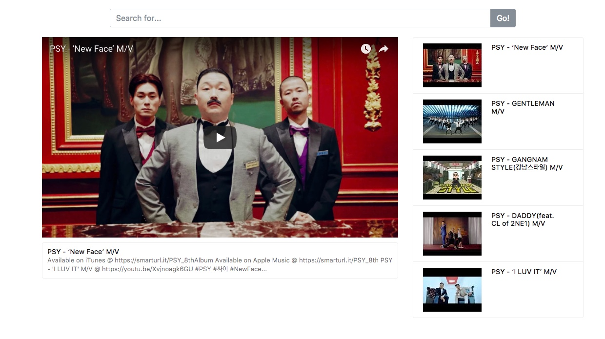

# YT-Search
React web app enables you to search Youtube videos with keywords.

Webpack, npm, ReactJs, Youtube Data API v3, Bootstrap_v4, Sass




Checkout this repo, install dependencies, then start the webpack-dev-server with the following:

```
git clone https://github.com/jazzed28/YT-Search.git
cd yt-search
npm install
npm run start
```
